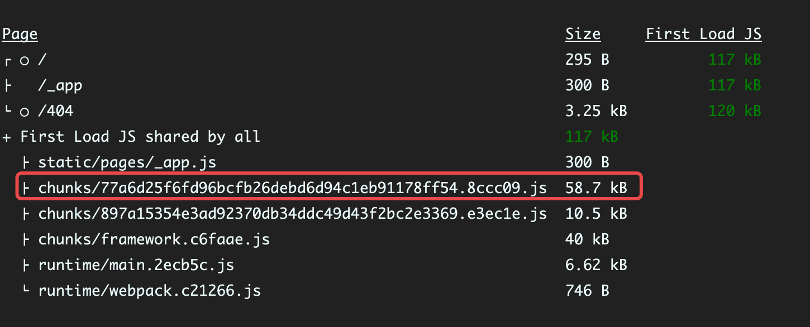
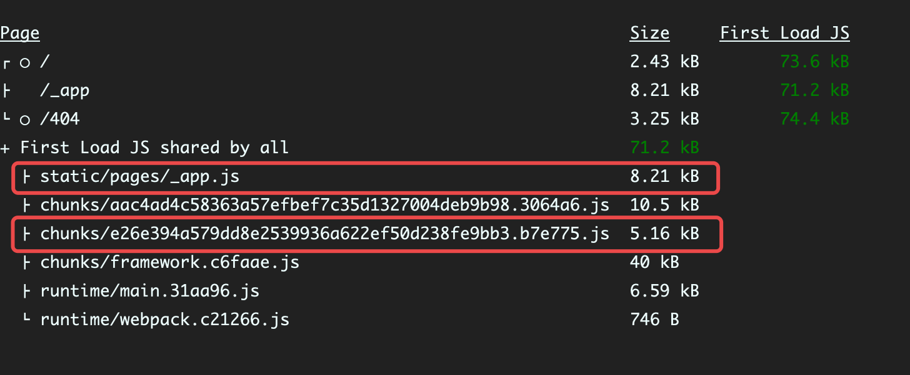

# Tree shaking with Next.js

## About

This is example of `tree-shaking` for [next.js](https://nextjs.com/). Note that `@next/bundle-analyzer` is not required.

## Getting Started

First, run the development server:

```bash
npm run dev
# or
yarn dev
```

Open [http://localhost:3000](http://localhost:3000) with your browser to see the result.

**Run the following command to see the size of the bundle:**

```bash
npm run analyze
# or
yarn analyze
```

## Preview

If we don't do anything, the volume of `geist-ui/react` is about `58kb`, note that **the volume here includes lib `styled-jsx`**.
It means that even if you use lib `styled-jsx` again, the volume will not increase.

At present, it seems that this volume of component library is still acceptable:



<br/>

**When we use `tree shaking`:**

The volume of `geist-ui/react` is about `13kb`.(It consists of two parts)
It should be noted that the specific package size depends on how many components you use.



## Other

If you don't use `tree shaking` in your project, bundle `geist-ui/react` as a `chunk`
every time, you may notice that the hash name of `chunk` is still changing,
this may cause you to not make full use of the cache.

- This issue from `next.js`, and they're improving that, you can track progress [here](https://github.com/vercel/next.js/issues/6303).
- If you want to customize config of webpack, to ensure that the `chunk` from `geist-ui/react` is always the same,
  you can refer to [this document](https://webpack.js.org/guides/code-splitting/).
